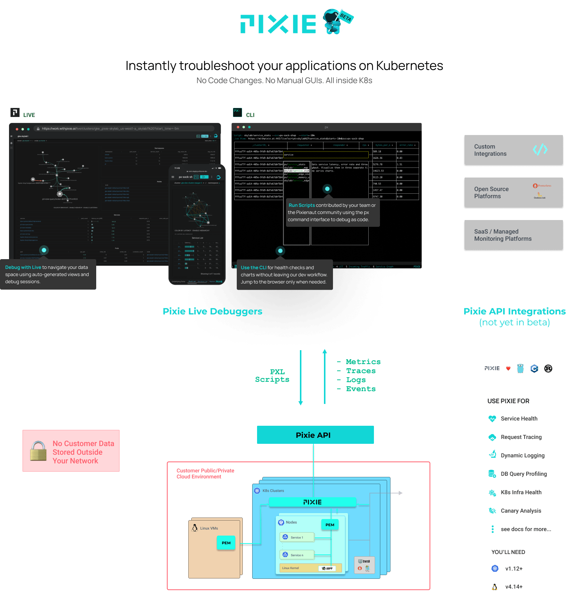

  

 

 

## What is Pixie?

Pixie gives you instant visibility by giving access to metrics, events, traces and logs without changing code.

We're building up Pixie for broad use by the end of 2020. If you are interested, feel free to try our [community beta](https://work.withpixie.ai/signup) and join our community on [slack](https://slackin.withpixie.ai/).

 

  
<strong>Table of contents</strong>

- [Quick Start](#quick-start)
- [Demo](#get-instant-auto-telemetry)
- [Contributing](#contributing)
- [Open Source](#open-source)
- [Platform Architecture](#under-the-hood)
- [About Us](#about-us)
- [License](#license)

## Quick Start

#### Signup

Visit our [product page](https://work.withpixie.ai/) and signup with your google account.

#### Install CLI

Run the command below:

`bash -c "$(curl -fsSL https://withpixie.ai/install.sh)"`

#### (optional) Setup a sandbox

If you don't already have a K8s cluster available you can:

- Set-up a local K8s environment
  - [Install Kind](https://kind.sigs.k8s.io/docs/user/quick-start/) and run `kind create cluster`
  - [Install Minikube](https://kubernetes.io/docs/tasks/tools/install-minikube/) and run `minikube start`
  - Review our [docs](https://docs.pixielabs.ai/installing-pixie/quick-start/) for alternate options.
- Start a demo-app
  - Deploy [Weaveworks'](https://www.weave.works/) [sock-shop](https://github.com/microservices-demo/microservices-demo) demo app by running `px demo deploy px-sock-shop`

#### 🚀 Deploy Pixie

Deploy the Pixie Platform in your K8s cluster by running:

`px deploy`
 

Check out our [install guides](https://docs.pixielabs.ai/installing-pixie/install-guides/) and [walkthrough videos](https://www.youtube.com/watch?v=iMh2f8abTYU) for alternate install schemes.

## Get Instant Auto-Telemetry

#### Run scripts with `px` CLI

  Service SLA:

`px run px/service_stats`

  Node health:

`px run px/node_stats`

  MySQL metrics:

`px run px/mysql_stats`

  Explore more scripts by running:

`px scripts list`

  Check out our [pxl_scripts](pxl_scripts) repo for more examples.

 

#### View machine generated dashboards with Live views

The Pixie Platform auto-generates "Live View" dashboard to visualize script results.

You can view them by clicking on the URLs prompted by `px` or by visiting:

`https://work.withpixie.ai/live`

 

#### Pipe Pixie dust into any tool

You can transform and pipe your script results into any other system or workflow by consuming `px` results with tools like [jq](https://stedolan.github.io/jq/).

Example with http_data:

`px run px/http_data -o json| jq -r .`

More examples [here](pxl_scripts)

 _To see more script examples and learn how to write your own, check out our [docs](https://work.withpixie.ai/docs) for more guides_

 

## Contributing

- **Bugs:** Something not working as expected? [Send a bug report](https://github.com/pixie-labs/pixie/issues/new?template=Bug_report.md).
- **Features:** Need new Pixie capabilities? [Send a feature request](https://github.com/pixie-labs/pixie/issues/new?template=Feature_request.md).
- **Views & Scripts:** Need help building a live views or pxl scripts? [Send a live view request](https://github.com/pixie-labs/pixie/issues/new?template=Live_view_request.md).
- **Pixienaut Community:** Interested in becoming a [Pixienaut](https://github.com/pixie-labs/pixie/tree/master/pixienauts) and in helping shape our community? [Apply here](https://pixielabs.ai/community/).

## Open Source

Along with building Pixie as a freemium SaaS product, contributing open and accessible projects to the broader developer community is integral to our roadmap.

We plan to contribute in two ways:

- **Open Sourced Pixie Platform Primitives:** We plan to open-source components of the Pixie Platform which can be independently useful to developers after our Beta. These include our Community Pxl Scripts, Pixie CLI, eBPF Collectors etc. If you are interested in contributing during our Beta, [email us](mailto:community@pixielabs.ai).
- **Unlimited Pixie Community Access:** Our [Pixie Community](https://work.withpixie.ai/) product is a completely free offering with all core features of the Pixie developer experience. We will invest in this offering for the long term to give developers across the world an easy and zero cost way to use Pixie.

## Under the Hood

Three fundamental innovations enable Pixie's magical developer experience:

**Progressive Instrumentation:** Pixie Edge Modules (“PEMs”) collect full body request traces (via eBPF), system metrics & K8s events without the need for code-changes and at less than 5% overhead. Custom metrics, traces & logs can be integrated into the Pixie Command Module.

**In-Cluster Edge Compute:** The Pixie Command Module is deployed in your K8s cluster to isolate data storage and computation within your environment for drastically better intelligence, performance & security.

**Command Driven Interfaces:** Programmatically access data via the Pixie CLI and Pixie UI which are designed ground-up to allow you to run analysis & debug scenarios faster than any other developer tool.

_For more information on Pixie Platform's architecture, check out our [docs](https://work.withpixie.ai/docs) or [overview deck](https://docsend.com/view/kj38d76)_

## Resources

- [Company Website](https://pixielabs.ai)
- [Documentation](https://work.withpixie.ai/docs)
- [Community Slack](https://slackin.withpixie.ai/)
- [Issue Tracker](https://github.com/pixie-labs/pixie/issues)
- [Community Overview](https://github.com/pixie-labs/pixie/tree/master/pixienauts)
- [Youtube](https://www.youtube.com/channel/UCOMCDRvBVNIS0lCyOmst7eg/videos)
- [Overview Slide Deck](https://docsend.com/view/kj38d76)

## About Us

Founded in late 2018, we are a San Francisco based stealth machine intelligence startup. Our north star is to build a new generation of intelligent products which empower developers to engineer the future.

We're heads down building Pixie and excited to share it broadly with the community later this year. If you're interested in learning more about us or in our current job openings, we'd love to [hear from you](mailto:info@pixielabs.ai).

## License

Pixie Community is the free offering of Pixie's proprietary SaaS product catalogue.

Our [PxL Scripts](pxl_scripts/README.md) are licensed under [Apache License, Version 2.0](pxl_scripts/LICENSE.md).

Other Pixie Platform components such as Pixie CLI and eBPF based Data Collectors will also be licensed under the Apache License, Version 2.0. Contribution of these are planned for Oct 2020.
