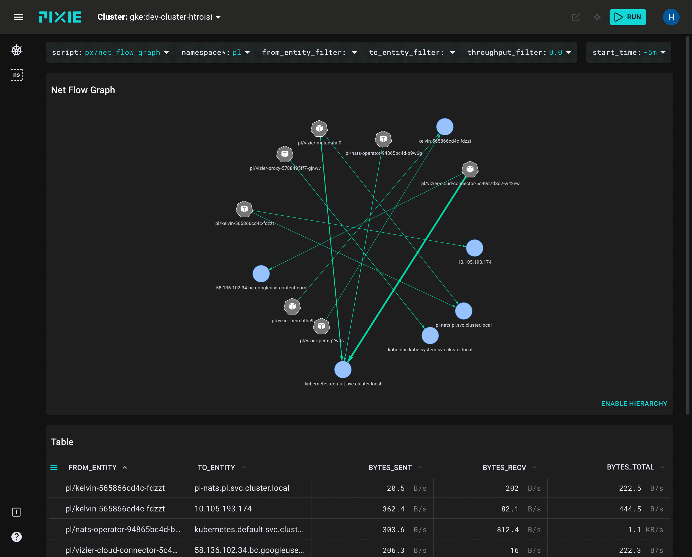
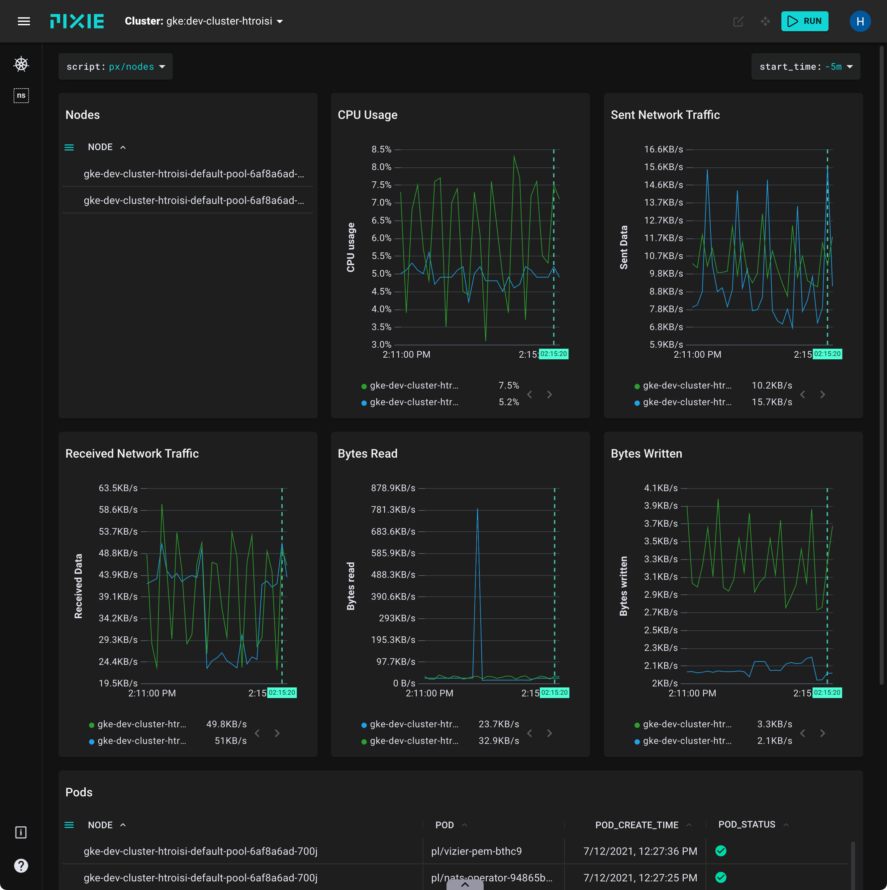
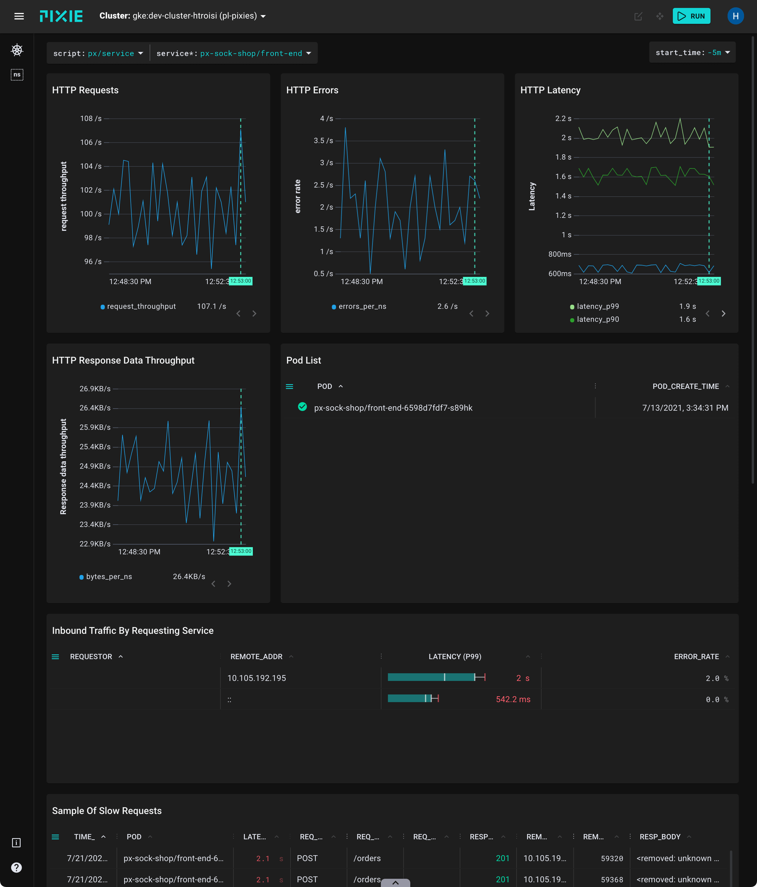
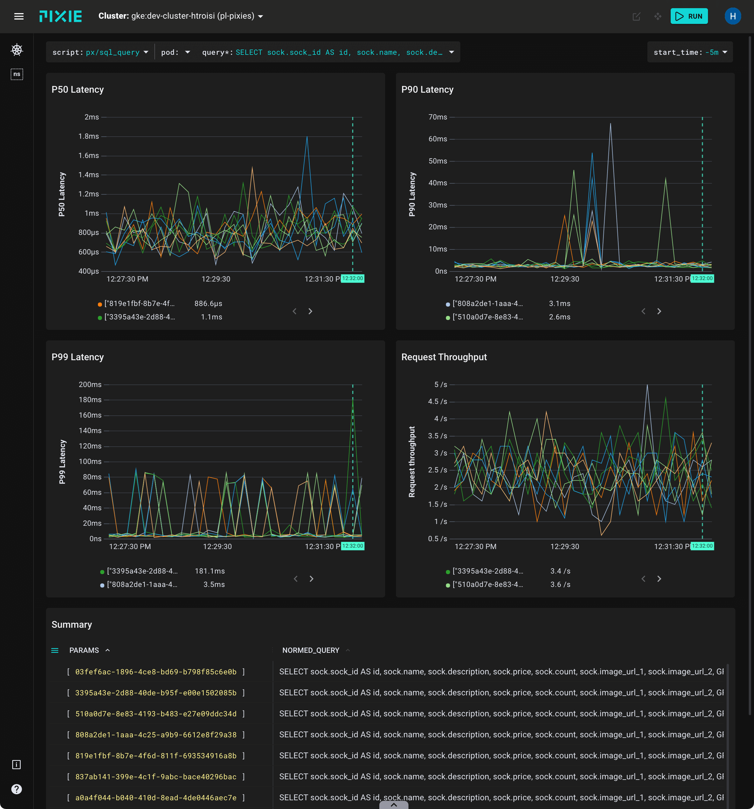
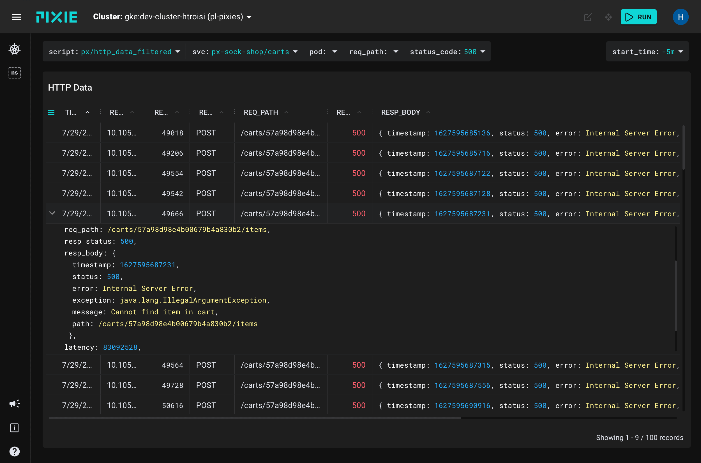
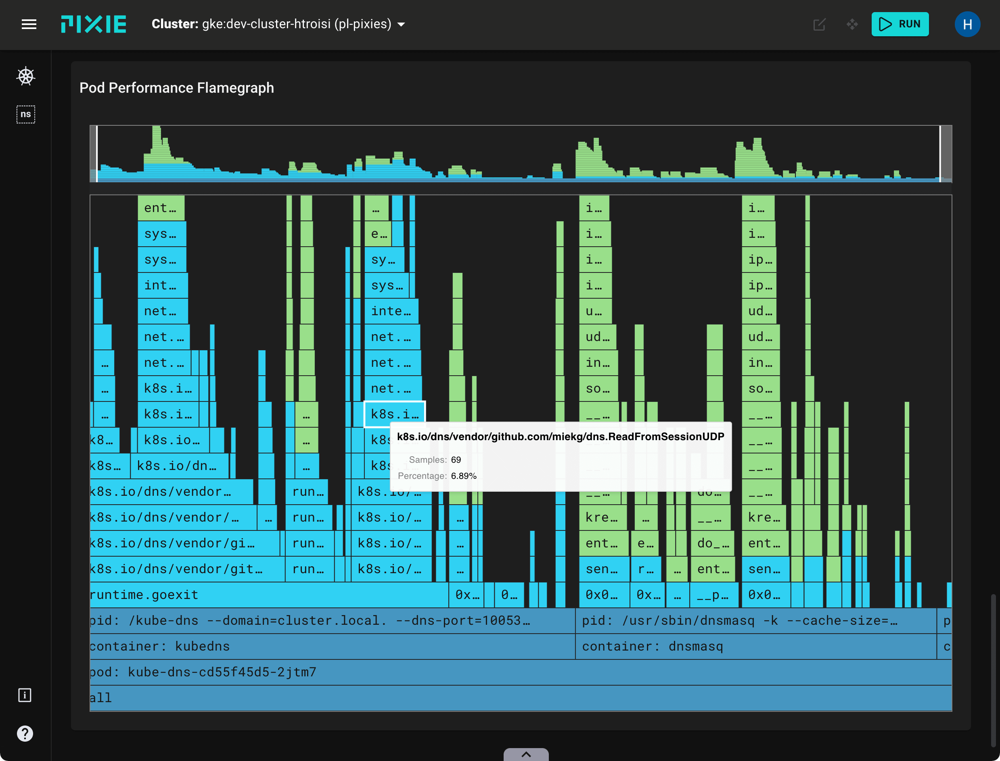

[](https://px.dev)

<br>

[](https://docs.px.dev)
[](https://slackin.px.dev)
[](https://twitter.com/pixie_run)
[](https://github.com/ramitsurana/awesome-kubernetes)
[](https://github.com/avelino/awesome-go)
[](https://github.com/pixie-io/pixie/actions/workflows/build_and_test.yaml)
[](https://codecov.io/gh/pixie-io/pixie)
[](https://app.fossa.com/projects/custom%2B26327%2Fgithub.com%2Fpixie-io%2Fpixie?ref=badge_shield)
[](https://artifacthub.io/packages/olm/community-operators/pixie-operator)
[](https://goreportcard.com/report/px.dev/pixie)
[](https://bestpractices.coreinfrastructure.org/projects/5027)
[](https://clomonitor.io/projects/cncf/pixie)
[](https://api.securityscorecards.dev/projects/github.com/pixie-io/pixie)

<br>

Pixie is an open-source observability tool for Kubernetes applications. Use Pixie to view the high-level state of your cluster (service maps, cluster resources, application traffic) and also drill down into more detailed views (pod state, flame graphs, individual full-body application requests).

## Why Pixie?

Three features enable Pixie's magical developer experience:

- **Auto-telemetry:** Pixie uses eBPF to automatically collect telemetry data such as full-body requests, resource and network metrics, application profiles, and more. See the full list of data sources [here](https://docs.px.dev/about-pixie/data-sources/).

- **In-Cluster Edge Compute:** Pixie collects, stores and queries all telemetry data locally in the cluster. Pixie uses less than 5% of cluster CPU and in most cases less than 2%.

- **Scriptability:** [PxL](https://docs.px.dev/reference/pxl/), Pixie’s flexible Pythonic query language, can be used across Pixie’s UI, CLI, and client APIs.

## Use Cases

### Network Monitoring



<br>

Use Pixie to monitor your network, including:

- The flow of network traffic within your cluster.
- The flow of DNS requests within your cluster.
- Individual full-body DNS requests and responses.
- A Map of TCP drops and TCP retransmits across your cluster.

<br>

For more details, check out the [tutorial](https://docs.px.dev/tutorials/pixie-101/network-monitoring/) or [watch](https://youtu.be/qIxzIPBhAUI) an overview.

<br clear="all">

### Infrastructure Health



<br>

Monitor your infrastructure alongside your network and application layer, including:

- Resource usage by Pod, Node, Namespace.
- CPU flame graphs per Pod, Node.

<br>

For more details, check out the [tutorial](https://docs.px.dev/tutorials/pixie-101/infra-health/) or [watch](https://youtu.be/2dFIpiBryu8) an overview.

<br clear="all">

### Service Performance



<br>

Pixie automatically traces a [variety of protocols](https://docs.px.dev/about-pixie/data-sources/). Get immediate visibility into the health of your services, including:

- The flow of traffic between your services.
- Latency per service and endpoint.
- Sample of the slowest requests for an individual service.

<br>

For more details, check out the [tutorial](https://docs.px.dev/tutorials/pixie-101/service-performance/) or [watch](https://youtu.be/Rex0yz_5vwc) an overview.

<br clear="all">

### Database Query Profiling



<br>

Pixie automatically traces several different [database protocols](https://docs.px.dev/about-pixie/data-sources/#supported-protocols). Use Pixie to monitor the performance of your database requests:

- Latency, error, and throughput (LET) rate for all pods.
- LET rate per normalized query.
- Latency per individual full-body query.
- Individual full-body requests and responses.

<br>

For more details, check out the [tutorial](https://docs.px.dev/tutorials/pixie-101/database-query-profiling/) or [watch](https://youtu.be/5NkU--hDXRQ) an overview.

<br clear="all">

### Request Tracing



<br>

Pixie makes debugging this communication between microservices easy by providing immediate and deep (full-body) visibility into requests flowing through your cluster. See:

- Full-body requests and responses for [supported protocols](https://docs.px.dev/about-pixie/data-sources/#supported-protocols).
- Error rate per Service, Pod.

<br>

For more details, check out the [tutorial](https://docs.px.dev/tutorials/pixie-101/request-tracing/) or [watch](https://youtu.be/Gl0so4rbwno) an overview.

<br clear="all">

### Continuous Application Profiling



<br>

Use Pixie's continuous profiling feature to identify performance issues within application code.

<br>

For more details, check out the [tutorial](https://docs.px.dev/tutorials/pixie-101/profiler/) or [watch](https://youtu.be/Zr-s3EvAey8) an overview.

<br clear="all">

### Distributed bpftrace Deployment

Use Pixie to deploy a [bpftrace](https://github.com/iovisor/bpftrace) program to all of the nodes in your cluster. After deploying the program, Pixie captures the output into a table and makes the data available to be queried and visualized in the Pixie UI. TCP Drops are pictured. For more details, check out the [tutorial](https://docs.px.dev/tutorials/custom-data/distributed-bpftrace-deployment/) or [watch](https://youtu.be/xT7OYAgIV28) an overview.

### Dynamic Go Logging

Debug Go binaries deployed in production environments without needing to recompile and redeploy. For more details, check out the [tutorial](https://docs.px.dev/tutorials/custom-data/dynamic-go-logging/) or [watch](https://youtu.be/aH7PHSsiIPM) an overview.

<br clear="all">

## Get Started


It takes just a few minutes to install Pixie. To get started, check out the [Install Guides](https://docs.px.dev/installing-pixie/install-guides/).

<br>

Once installed, you can interact with Pixie using the:

- [Web-based Live UI](https://docs.px.dev/using-pixie/using-live-ui/)
- [CLI](https://docs.px.dev/using-pixie/using-cli/)
- [API](https://docs.px.dev/using-pixie/api-quick-start/)

<br clear="all">

## Get Involved

Pixie is a community-driven project; we welcome your contribution! For code contributions, please read our [contribution guide](CONTRIBUTING.md).

- File a [GitHub issue](https://github.com/pixie-io/pixie/issues) to report a bug or request a feature.
- Join our [Slack](https://slackin.px.dev) for live conversations and quick questions. We are also available on the [CNCF slack](https://slack.cncf.io/app_redirect?channel=pixie").
- Follow us on [Twitter](https://twitter.com/pixie_run) and [YouTube](https://www.youtube.com/channel/UCOMCDRvBVNIS0lCyOmst7eg).
- Add our community meeting [calendar](https://calendar.google.com/calendar/u/0?cid=Y181OTA0Y2ZmNzdhNzdhOGYzMzQxNmNmMjQzODI4ZjY4ZGY5MWMzYzEzZWU3YmQ5NGFjODUzMmRiODg2Y2VjMjkxQGdyb3VwLmNhbGVuZGFyLmdvb2dsZS5jb20).
- Provide feedback on our [roadmap](https://docs.px.dev/about-pixie/roadmap/).

<br clear="all">

## Latest Releases
We version separate components of Pixie separately, so what Github shows as the "latest" release will only be the latest for one of the components.
We maintain links to the latest releases for all components here:
- [CLI v0.8.2](https://github.com/pixie-io/pixie/releases/tag/release/cli/v0.8.2)<!--cli-latest-release-->
- [Cloud v0.1.7](https://github.com/pixie-io/pixie/releases/tag/release/cloud/v0.1.7)<!--cloud-latest-release-->
- [Vizier v0.14.8](https://github.com/pixie-io/pixie/releases/tag/release/vizier/v0.14.8)<!--vizier-latest-release-->
- [Operator v0.1.4](https://github.com/pixie-io/pixie/releases/tag/release/operator/v0.1.4)<!--operator-latest-release-->

## Changelog

The changelog is stored in annotated git tags.

For vizier:

```
git for-each-ref refs/tags/release/vizier/$tagname --format='%(tag) %(contents)'
```

For the CLI:

```
git for-each-ref refs/tags/release/cli/$tagname --format='%(tag) %(contents)'
```

These are also published on the [releases](https://github.com/pixie-io/pixie/releases) page.

## Adopters

The known adopters and users of Pixie are listed [here](ADOPTERS.md).

## Software Bill of Materials

We publish a list of all the components Pixie depends on and the corresponding
versions and licenses [here](https://storage.googleapis.com/pixie-dev-public/oss-licenses/latest.json).

## Acknowledgements

The Pixie project would like to thank [Equinix Metal](https://www.equinix.com/) via the [CNCF Community Infrastructure Lab](https://github.com/cncf/cluster) for graciously providing compute resources to run all the CI/CD for the project.

## About Pixie

Pixie was contributed by [New Relic, Inc.](https://newrelic.com/) to the [Cloud Native Computing Foundation](https://www.cncf.io/) as a Sandbox project in June 2021.

## License

Pixie is licensed under [Apache License, Version 2.0](LICENSE).
