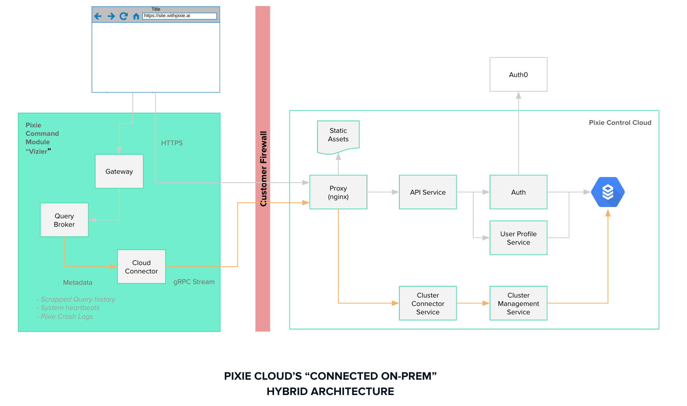

#### What pain-point does Pixie address?

Pixie is designed to reduce Meant Time to Isolation (MTTI) for performance incidents in production & staging environments.

#### Who is Pixie designed for and how do they use it?

Pixie is designed for two primary personas:
- **Application Developers** responsible for monitoring the health of services they own.
- **On-Call Engineers** SRE, DevOps, SWEs etc., responsible for incident response.

Pixie's Beta releases will include:
- **Pre-Configured Dashboards** for passive health monitoring.
- **Live Debugger** for rapid analysis of live data.

#### How does Pixie work?
The underlying product architecture is designed to provide developers unsampled access to live telemetry (network spans, metrics & ci/cd events) with minimal instrumentation.

The three primary components of the system are:
- **Pixie Edge Modules (PEM):** Deployed as DaemonSets, PEM's leverage Pixie's eBPF collector to collect network transactions and system metrics without any code changes.
- **Pixie Command Modules:** Deployed as a set of K8s services within the monitoried cluster, it is responsible for data aggregation, data integration and query execution.
- **Pixie Console:** Developer facing web application which surfaces user-interfaces for debugging, adminstration & API management.

#### How does Pixie Control Cloud Work?

Pixie Control Cloud enables Pixie's connected on-premises deployment of the monitoring backend. It is designed to track metadata while allowing for all customer data to stay local behind the customer firewall. This is achieved by the following:

- The browser interacts with both the cloud service (for auth, management, etc) and Command Module (for executing queries). 
- Command Module maintains a one-way connection to the Pixie cloud (initiates the connection, but bidirectional traffic is allowed).
- The cloud connector on the Command Module side will send aggregated metrics, heartbeats, etc. to the Pixie Control Cloud system.

