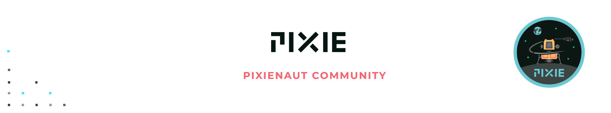

  

---

## Pixienaut Community

[Pixienauts](https://pixielabs.ai/community) are early adopters who help shape Pixie's product and community for broad use by the end of 2020.  

**What are their backgrounds?** 

They are systems geeks who tinker with tools which help engineers move faster and are interested in our focus areas of no-instrumentation data collection, edge compute and command drive developer interfaces.

**What do they do?** 

Pixienauts share domain expertise & debugging knowledge via bi-weekly online meetups, community slack, community github & guest blogs.

**How to be a Pixienaut?** 

1. [Apply here](https://pixielabs.ai/community)
2. [Install Pixie](https://work.withpixie.ai/)
3.  File a [bug or feature request](https://github.com/pixie-labs/pixie/issues)and you're set!

## Pixienaut Office Hours

We host bi-weekly video calls attended by Pixienauts, Pixie team members and invited guests.

**When:** [Bi-weekly call](https://calendar.google.com/calendar?cid=cGl4aWVsYWJzLmFpXzFvODd2anQ3OG1yNnFhbThnYTNwaHYxZGU0QGdyb3VwLmNhbGVuZGFyLmdvb2dsZS5jb20) on Friday at 10:30am PT / 5:30PM UTC

**Format:** [Zoom call](https://zoom.us/j/610031572?pwd=WEMwUlgzWmtWa1cxTVhZcVR6c0Mxdz09)

**Agenda:** Each office hours has the following three sections with ad-hoc additions as necessary: 
- Feedback from Pixienauts on ways to improve Pixie.
- Demos of upcoming features by Pixie team.
- Demos by Pixienauts for community feedback.

**Follow-ups:** 
- Recordings posted on [youtube.](https://www.youtube.com/channel/UCOMCDRvBVNIS0lCyOmst7eg/videos)
- Action items filed as issues [here.](https://github.com/pixie-labs/pixie/issues)
- Meeting notes & links emailed to [mailing list.](mailto:pixienauts@pixielabs.ai)

## Resources

- [Community Slack](https://slackin.withpixie.ai/)
- [Mailing List](mailto:pixienauts@pixielabs.ai)
- [Pixie Docs](https://work.withpixie.ai/docs)
- [Shared GDrive Folder](https://drive.google.com/drive/folders/0AMBzBO92FQaUUk9PVA)
