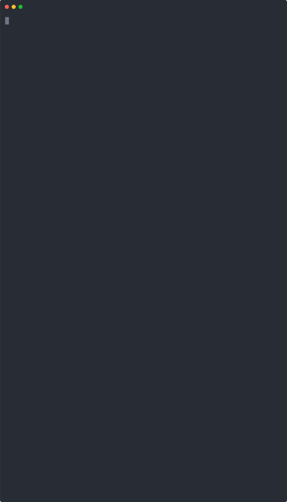
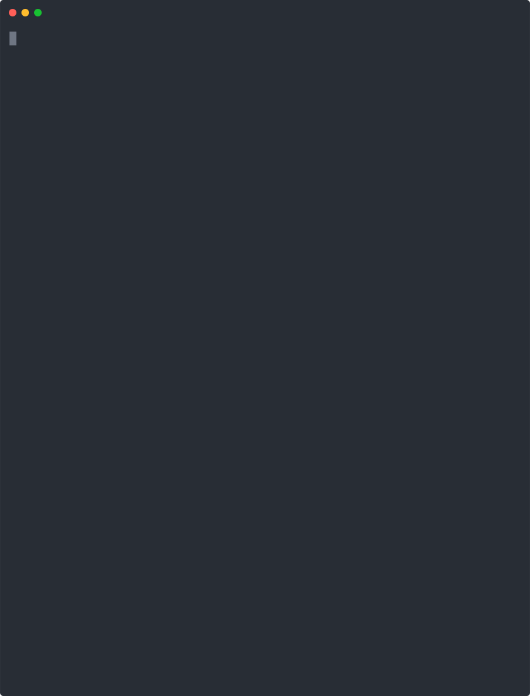

# PXL Scripts Overview

Pixie utilize PxL (Pixie Language) scripts. To learn more about PxL, take a look at our documentation [here](https://docs.pixielabs.ai/pxl). 


PXL scripts can easily be run using the PX CLI tool. Currently PXL scripts can be passed directly to
the CLI by running:

```bash
px run -f <script.pxl>
```

or utlizing one of our pre-built scripts. These can be listed and run as follow:

```bash
px run -l                # List out pre-built scripts
px run <script_name>     # Run one of the pre-built scripts.
```

Px supports standard output formats such as json, making it easy to consume the script's output using
other CLI tools. For example:

```bash
px run <script_name> -o json | jq -r .
```

PXL has support for building visualizations, which can be viewed in Pixie's live UI. More details coming soon!

We plan to open source our PXL scripts, open it up for contribution and back them using this git repository before launch later this year.
The rest of this page contains examples of the sample scripts.

<details>
  <summary><strong>Table of contents</strong></summary>

- [Show Pixie Status](#show-pixie-status)
- [Show HTTP Requests](#http-requests)
- [Show MYSQL Requests](#mysql-requests)
- [Show Scripts](#show-scripts)
</details>


## Show Pixie Status
The following scripts/commands can be used to show the status of Pixie on your cluster:

`px get viziers` : Shows the registered K8s clusters that are running Pixie and thier current status.
`px get pems`    : Shows the current status of the Pixie Edge Modules. Also, usable as `px run px/agent_status`.





## HTTP Requests
Pixie automatically captures all HTTP, HTTP/2, GRPC requests on your clusters. To see a preview of this data
you can utlize the following script: `px/http_data`.




## MYSQL Requests
Pixie automatically captures all MySQL, Cassandara, PostgreSQL (coming soon). To see this data for the sock-shop demo applicatio you can run: `px/mysql_data`.


## Show Scripts
If you are interested in looking at the pxl script, or modifying them you can dump out the script using `px script show <script_name>`.


The demo scripts are well documented and have many parameters than can be modified. We are working ot expose these as command line arguments, but for now you can easily dump and edit the scripts.
