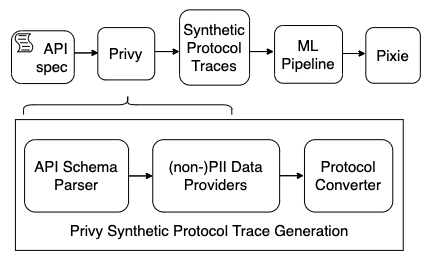

_Privy_ is a command line tool for generating synthetic protocol traces similar to those that Pixie collects from pods in a Kubernetes cluster. It uses [OpenAPI descriptors](https://swagger.io/resources/open-api/) and fake data sources for Personally Identifiable Information (PII) to produce full-body messages in a variety of formats:

- `JSON`
- `XML`
- `SQL` (PostgreSQL and MySQL)
- `HTML`
- `Protobuf` (in progress)

A full [sample dataset is available on huggingface](https://huggingface.co/datasets/beki/privy). This data may be used for demo purposes, to train PII detection models, and to evaluate existing PII identification systems.

For instance, this [PII anonymizer demo](https://huggingface.co/spaces/beki/pii-anonymizer) ([backup link](https://detect.streamlitapp.com/)) uses a [custom NLP model](https://huggingface.co/beki/en_spacy_pii_distilbert) trained on data from Privy.

For more information, see this [blog post on PII detection in debugging data](https://blog.px.dev/detect-pii/).



# Quickstart

1. Generate json data in bazel's sandboxed runtime directory. By default, privy downloads ~4000 API specs from the [OpenAPI directory](https://github.com/APIs-guru/openapi-directory) to generate data from.

```bazel
bazel run //privy/generate:privy_generate
```

2. [Optional] Specify an absolute path to store synthetic data in with `--out_folder`, the type(s) of data to generate with `--generate`, and log priority level with `--logging`. For brevity, you can also use the first letter of each option.

```bazel
bazel run //privy/generate:privy_generate -- --out_folder=/path/to/output/directory --generate json sql --logging=debug
```

# Synthetic Data Formats

Privy produces three dataset files for each specified protocol type (e.g. json).

**payloads-{protocol_type}.csv** contains a text sample per line along with a binary `has_pii` label and the `pii_types` contained in the sample. For example:

```bash
# JSON payload, has_pii, pii_types
|{"first_name": "Moustafa", "sale_id": "235234"}|,1,first_name
```

**templates-{protocol_type}.txt** contains a unique string template for each sample in the dataset

```bash
# Values enclosed in {{}} are matched with an appropriate data provider at runtime
{"first_name": "{{person}}", "sale_id": "{{integer}}"}
```

**spans-{protocol_type}.json** contains labeled (non-)PII samples with the offsets of each PII token in the sample

```bash
# text sample, span for each PII entity along with its location in the string and type, the template used this span, a unique ID for the template used to generate this span
{"fake": "{\"first_name\": \"Moustafa\", \"sale_id\": \"235234\"}", "spans": "[{\"value\": \"Moustafa\", \"start\": 15, \"end\": 24, \"type\": \"person\"}]", "template": "{\"first_name\": \"{{person}}\", \"sale_id\": \"235234\"}", "template_id": 0}
```

## Great, but what is this data good for?

**payloads →** train a binary or multi-label PII model to classify a given text sample as containing PII.

**templates →** generate your own dataset using unique string templates. That way you can switch out the data providers and generate data tailored to your particular use case. Take a look at [presidio’s data generator](https://github.com/microsoft/presidio-research/tree/master/presidio_evaluator/data_generator) for an example of how to do this! Alternatively, you can simply add to [Privy’s existing data providers](https://github.com/pixie-io/pixie/tree/main/src/datagen/pii/privy/privy/providers).

**spans** → train a Named Entity Recognition model for token-wise classification (and redaction) of PII.

## Train a sequence labelling model using [FlairNLP](https://github.com/flairNLP/flair)

```
bazel run //privy/train:privy_flair_ner -- --input=/path/to/input/spans.json
```

## Visualize PII distribution in generated synthetic data

```
bazel run //privy/generate:privy_visualize -- --input=path/to/input/data-payloads.csv
```

## Truncate protocol traces to a maximum number of characters per line like Pixie does

```
bazel run //privy/generate:privy_truncate -- --input=path/to/input/data-payloads.csv
```

## Run Tests

```bazel
bazel test ...
```

# More options

```
options:
  -h, --help            show this help message and exit
  --generate_types {json,sql,proto,xml,html} [{json,sql,proto,xml,html} ...], -g {json,sql,proto,xml,html} [{json,sql,proto,xml,html} ...]
                        Which dataset to generate. Can select multiple e.g. json sql proto xml (default: ['json'])
  --region {english_us,german_de}, -r {english_us,german_de}
                        Which language/region specific providers to use for PII generation. (default: english_us)
  --logging {debug,info,warning,error}, -l {debug,info,warning,error}
                        logging level: debug, info, warning, error (default: info)
  --out_folder OUT_FOLDER, -o OUT_FOLDER
                        Absolute path to output folder. By default, saves to bazel cache for this runtime.
  --api_specs API_SPECS, -a API_SPECS
                        Absolute path to folder download openapi specs into. Privy checks if this folder already exists.
  --fake_persons_file_path FAKE_PERSONS_FILE_PATH, -fp FAKE_PERSONS_FILE_PATH
                        Absolute path to file containing fake person data downloaded from fakenamegenerator.com. (default: )
  --multi_threaded, -m  Generate data multithreaded (default: False)
  --num_additional_pii_types NUM_ADDITIONAL_PII_TYPES, -n NUM_ADDITIONAL_PII_TYPES
                        Upper bound for the number of PII types to generate when inserting additional PII into sensitive payloads. E.g. 6 (default: 6)
  --equalize_pii_distribution_to_percentage EQUALIZE_PII_DISTRIBUTION_TO_PERCENTAGE, -e EQUALIZE_PII_DISTRIBUTION_TO_PERCENTAGE
                        Equalize distribution of PII in the dataset to the given percentage by generating additional PII payloads for pii types with the lowest count. To disable, set to 0. (default: 50)
  --timeout TIMEOUT, -t TIMEOUT
                        Timeout (in seconds) after which data generation for the current openAPI descriptor will be halted. Very large descriptors tend to slow down data generation and skew the output
                        dataset, so we apply a uniform timeout to each. (default: 400)
  --pii_types PII_TYPES [PII_TYPES ...], -p PII_TYPES [PII_TYPES ...]
                        PII types to match and generate. If not specified, all available PII types will be matched. (default: None)
  --fuzz_payloads, -f   Fuzz payloads by removing characters. (default: False)
  --spans_per_template SPANS_PER_TEMPLATE, -s SPANS_PER_TEMPLATE
                        Number of (non-)PII spans (NER-compatible, token-wise labeled samples) to generate per unique payload template. (default: 10)
  --ignore_spec IGNORE_SPEC [IGNORE_SPEC ...], -ig IGNORE_SPEC [IGNORE_SPEC ...]
                        OpenAPI specs to ignore. If not specified, all specs will be matched. (default: ['stripe.com'])
```
