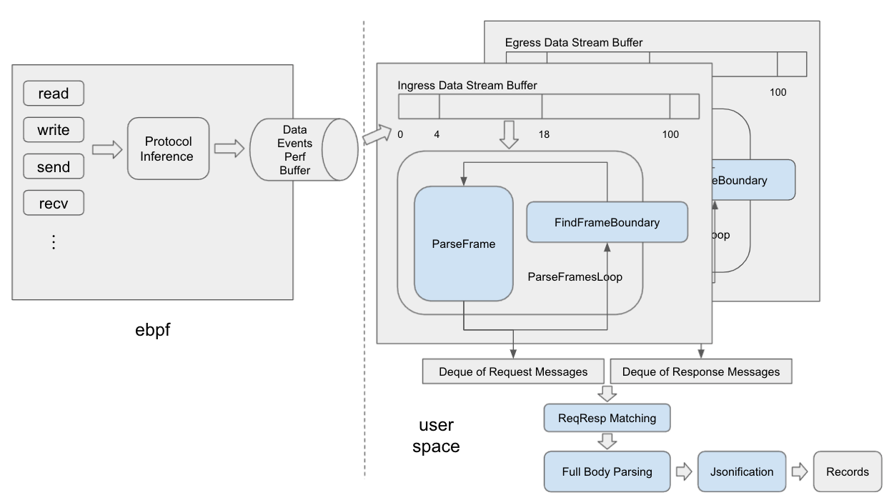
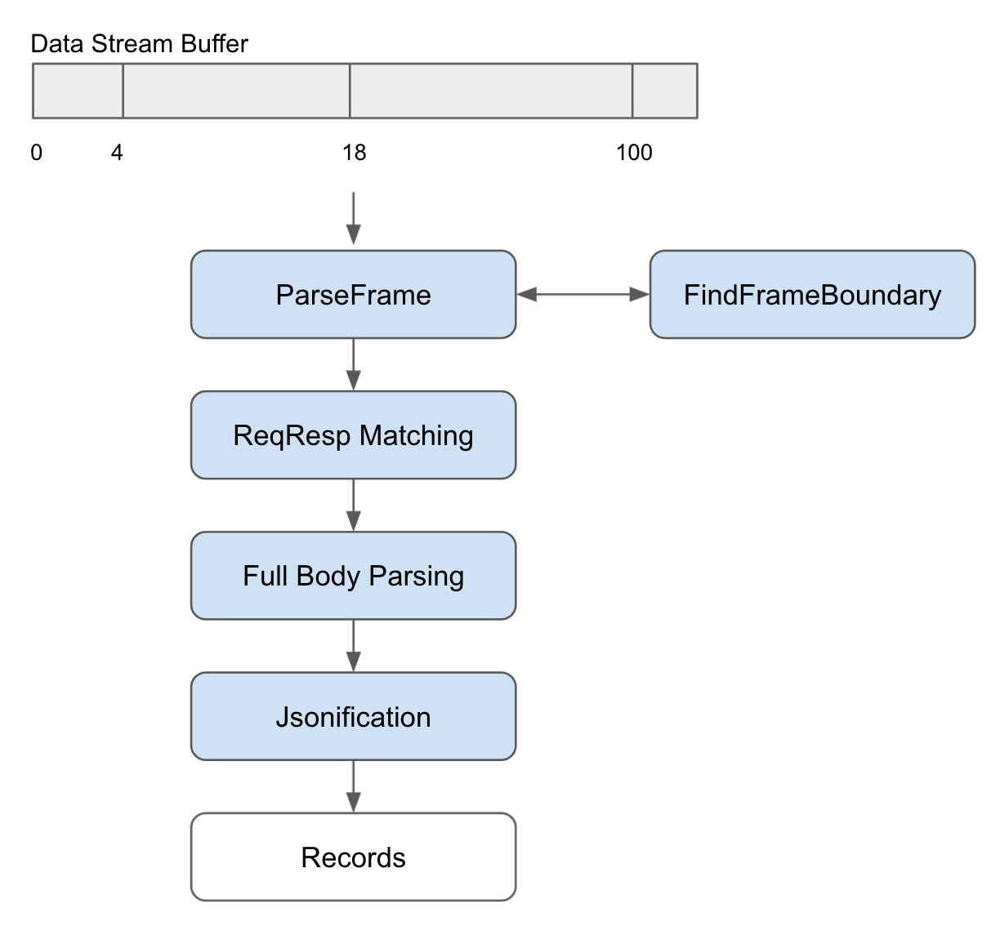

# How to contribute a protocol parser to Pixie?
This documentation provides a step-by-step guide on how to contribute a new protocol to Stirling’s
protocol tracer.

## Background
The **Protocol Tracer** is the component of Stirling that captures protocol messages for observability
purposes. The protocol tracer parses the captured messages according to the protocol, and exports
them to Pixie tables for future querying. In Pixie, these traced protocol messages can be viewed
directly, and are also used as the basis of visualizations like service maps.

To trace a message for a given protocol, the Protocol Tracer requires a protocol parsing code for
each protocol. There are currently a number of supported protocols (e.g. HTTP, DNS, MySQL, Kafka,
etc.), and more are being added.

This document describes the architecture of the Stirling protocol tracer, with a focus on the
protocol parsing pipeline to assist with the development of new protocol tracing support.

## Overview of the protocol parsing flow


In the Stirling protocol tracer, network traffic is captured with eBPF probes whenever applications send and receive messages. The captured data is then submitted as events to Stirling’s user-space code through an eBPF perf buffer.

On the user-space side, Stirling copies the eBPF-captured data in these events into Data Stream Buffers that track the connection. Separate ingress and egress data stream buffers store request and response data, respectively, on the server side. The data stream buffer itself is contiguous, and is a best-effort replica of the raw bytes sent at the application layer, i.e. without TCP/IP headers.

Once the application data is in the data stream buffer, a protocol parser processes the data into well-formed request and response messages. Next, a request-response matcher associates responses to the appropriate request. Finally, the request/response data is structured into records which are exported from Stirling.

Up until the data stream buffer, the data collection pipeline is protocol-agnostic (other than protocol inference, which we will talk about later).

The rest of this document goes into further detail for each of these steps, to demonstrate how a new protocol parser can be implemented in the Stirling protocol tracer.

## Terminology
Because every protocol is different, we first define some common terminology to describe network traffic at different levels of abstraction.

Frame: The most basic data unit of the protocol, typically with a header and a body.

Request / Response: A request or response consists of one or more frames sent together representing one message.

Record: A record is typically a request-response pair with some optional metadata.

To contribute a new protocol, work is most needed in implementing robust frame parsing, request-response matching, and full-body parsing.

## Define protocol types

Before we can implement the parser, we need to define some types for the new protocol in `types.h`

- Frame

  Typically, a protocol will have a common header that's present in all the frames, such as a tag that's used for request response matching. A `struct Frame` should store the basic header in separate fields. The `msg` field typically stores a string of raw bytes sliced from the data buffer, and the `tag` field is used for request response matching.

    ```cpp
    struct Frame : public FrameBase {
      int32_t tag;
      std::string msg;

      size_t ByteSize() const override { return sizeof(Packet) + msg.size(); }
    };
    ```

- Request / Response

  Requests and Responses are one-level above the Frames, and each can be formed from one or multiple frames. `struct Request` or `struct Response` should contain request/response specific data and have fields that roughly match the columns of the output table, typically including opcode, id, msg etc. Different from the `msg` field in `struct Frame`, the `msg` field here is typically a JSON string containing information in the body. When the protocol is very simple or full body parsing is not needed, we don’t need to explicitly define Request and Response, and can just use Frame as Request or Response instead.

    ```cpp
    struct Request {
      int32_t opcode;
      std::string id;
      std::string msg;
      uint64_t timestamp_ns;

      std::string ToString() const {
        return absl::Substitute("timestamp=$0 id=$1 opcode=$2 msg=$3",
                                timestamp_ns, client_id, magic_enum::enum_name(opcode), msg);
      }
    };
    ```

- Record

  A `struct Record` is typically a request-response pair, but may include additional information as needed.

    ```cpp
    struct Record {
      Request req;
      Response resp;

      std::string ToString() const {
        return absl::Substitute("req=[$0] resp=[$1]", req.ToString(), resp.ToString());
      }
    };
    ```

- Intermediate structs used in parsing

  Often we will want to support full-body tracing and present the body as a JSON. We could define intermediate structs specific to each opcode that can be easily serialized to JSON.

  For example, the `FetchResp` in Kafka has three integer fields, and an array of `FetchRespTopic`s, which are intermediate structs. The ToJSON function uses the  `JSONObjectBuilder` as a simple interface to serialize the struct in a SAX style. See the Jsonification section below.

    ```cpp
    struct FetchResp {
      int32_t throttle_time_ms;
      int16_t error_code = 0;
      int32_t session_id = 0;
      std::vector<FetchRespTopic> topics;

      void ToJSON(utils::JSONObjectBuilder* builder) const {
    		...
      }
    };
    ```

## Parsing utilities

In `src/stirling/utils/binary_decoder.h`, the BinaryDecoder class provides some convenient utility functions for extracting chars, strings, or integers from a buffer. We should use these functions when implementing the `ParseFrame`, `FindFrameBoundary`, and full body parsing in the `StitchFrames` functions below. We could also extend these functions for protocol-specific types.

## Protocol-specific black boxes

With the basic types defined for our new protocol, we can now start implementing the parsing pipeline. There are 5 functions that need to be implemented (marked blue in the diagram above):
- ParseFrame
- FindFrameBoundary
- StitchFrames(ReqResp Matching)
- Full Body Parsing (optional)
- Jsonification




Implement one black box at the time and submit a pull request on Github to get some feedbacks before moving onto the next one.

### ParseFrame (buffer → frame)

`ParseFrame` extracts a `Packet`  out of raw data received on the wire.

```cpp
ParseState ParseFrame(message_type_t type, std::string_view* buf, Packet* result, State* state)
```

The `ParseFrame` function receives the raw data from a buffer as input, and parses out a single packet from the buffer if possible. Since eBPF data events can arrive out of order(or be lost/dropped altogether), there might be a missing chunk of data in the data buffer. The `buf` passed into `ParseFrame` is all the contiguous data at the front of the buffer that have been received so far. Thus at this point, there is **no guarantee that the data is valid or that the buffer is aligned with the start of a packet**. To be robust, we need to add checks on each expected field, and use additional information from a persistent state if needed to determine:

1. if the current packet is valid

2. where the current packet ends

If we return `kSuccess`, we should update the `msg` field in the `result` packet, and remove the data from the buffer. If we return `kInvalid`, the `FindFrameBoundary` function will kick in to find the next possible frame boundary. If we return `kNeedsMoreData`, the buffer will not be cleared and we will try again at the next cycle.

### FindFrameBoundary

`FindFrameBoundary` is the mechanism for the parser to recover from a confused state.

```cpp
size_t FindFrameBoundary(message_type_t type, std::string_view buf, size_t start_pos, State* state)
```

The `ParseFramesLoop` function in `event_parser.h` calls `ParseFrame` and `FindFrameBoundary` in a loop. If `ParseFrame` returns `kInvalid`, i.e. the parser is confused, then FindFrameBoundary is called to quickly iterate through each position in the buffer and determine the next possible location that can be the start of a frame. It is meant to be a quick check to filter out impossible positions for frame boundaries. The state here can be particularly helpful if there's revealing information across frames. For example, if we have seen a request with a certain tag, a response with the same tag becomes highly likely.
### StitchFrames (frames → request/response → record)

```cpp
RecordsWithErrorCount<Record> StitchFrames(std::deque<Packet>* req_packets,
std::deque<Packet>* resp_packets, State* state)
```

Packets successfully parsed from `ParseFrame` are appended into a deque. With a request deque and a response deque of packets, we typically process them into requests and responses before matching them together to create records. There are mainly two ways to do request response matching: sequential matching and tag-based matching.

Protocols like HTTP uses sequential matching, whereas protocols like Kafka or MySQL use tag-based matching.

Note: At the end of the function, we clear the response deque, because we are not expecting it's corresponding request anymore. If a request hasn't been matched, we keep it in the deque, since the response can still show up in the next cycle. See implementation in other protocols for reference.

### Full Body Parsing

Currently, full body parsing is done as part of the `StitchFrames` function. For most protocols, we would want full body tracing, and often, this is only possible after the request/response matching phase. For example, Kafka response parsing requires knowing the opcode, which is only available in the corresponding request. Typically, we could implement more helper functions to extract body fields into semantic types depending on the opcode.
### Jsonification

With each request / response message fully parsed, we can add a ToJSON interface that converts a semantic type like `struct FetchResp` into a JSON String. We recommend using the `JSONObjectBuilder` provided in `src/common/json/json.h`, which is a wrapper around rapidjson. The wrapper also helps deal with nested structs. See example below.
```cpp
template <typename T>
std::string ToString(T obj) {
  utils::JSONObjectBuilder json_object_builder;
  obj.ToJSON(&json_object_builder);
  return json_object_builder.GetString();
}

struct FetchResp {
  ...
  void ToJSON(utils::JSONObjectBuilder* builder) const {
  builder->WriteKV("name", name);
  builder->WriteKVArrayRecursive<FetchReqPartition>("partitions", partitions);
  }
}

```

## Next Steps
Now we have added the required functions for the new protocol, we just have a few steps left until it can start tracing live traffic. Please see part 2: How to hook up a new protocol parser?
