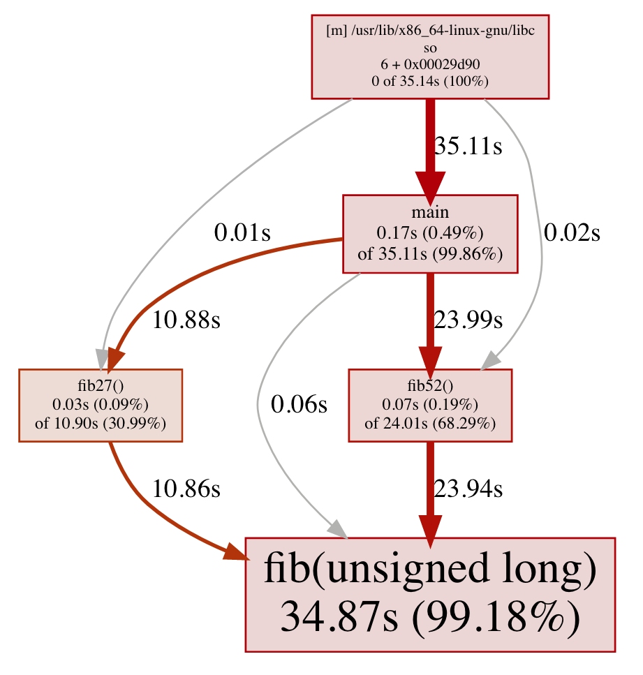

# Stirling profiler notes

### Perf profiler organization
TODO(jps): describe the various source code files and their respective purposes.

### Symbolization notes
TODO(jps): cover symbolization for compiled & Java and symbol caching.

### Missing stack frames
While investigating issue [#719](https://github.com/pixie-io/pixie/issues/719), we noticed that infrequently (less than 0.5% of the time, e.g.) we observed a stack trace with a missing stack frame. Fixing the test case to accommodate the issue was easy, but not informative. Here, we document our investigation into the root cause of the issue.

This rendering of a call-graph shows arcs from `main` directly to `fib` and from `libc` directly to `fib27` and to `fib52`. None of those arcs are expected by the program structure (where main calls `fib27` and `fib52`, and this in turn call `fib`).



##### The issue
The missing stack frames we observed were caused by stack trace samples captured at function entry:
```
push   %rbp
mov    %rsp, %rbp
```
or at function exit:
```
pop    %rbp
ret
```
If the stack trace is sampled exactly when the program counter points to either the `push` or `ret` instructions shown above, then the stack trace (when walked using frame pointers) will start from the caller's ancestor function: the stack trace will skip the caller of the leaf function and wrongly connect the leaf function to its caller's calling function.

##### Walking back through the stack to find a stack trace
To understand why, we first needed to understand how the kernel walks back through the stack [1] to reconstruct a stack trace.

Here we show a sketch of the algorithm used by the [kernel stack walker](https://github.com/torvalds/linux/blob/e1c04510f521e853019afeca2a5991a5ef8d6a5b/arch/x86/events/core.c#L2864):
1. Register `rbp` points to the saved frame base pointer of the calling function. Dereference `rbp` and store in a local variable (we will use variable name `fp` for the saved frame pointer).
2. Read register `rip`, the instruction pointer. This is the leaf address in the stack trace.
```
stack_trace.push_back(rip);
```
3. The function return address is always the last thing pushed to the stack before calling a new function. Thus, the function return address is at memory location `rbp + 8` [2]. Read the function return address and add it to the stack trace.
```
fn_return_address = *(fp + 8);
stack_trace.push_back(fn_return_address);
```
4. Follow the pointer stored in `fp` to update it with the next caller's frame pointer (the saved frame pointers each, in turn, point to their caller's stack):
```
fp = *fp
```
5. If the value now stored in `fp` is not a valid stack address, exit, else goto step (3).

In pseudo code:
```
fp = *rbp;
stack_trace.push_back(rip);
while(true) {
  fn_return_address = *(fp + 8);
  stack_trace.push_back(fn_return_address);
  fp = *fp;
  if(!valid_stack_address(fp)) {
    break;
  }
}
```

[1] For this method to work, the program must be compiled using the "frame pointer" convention, i.e. the compiler optimization `-fomit-frame-pointer` (or equivalent) must not be in use.

[2] x86 stacks grow "down" so the bottom of the stack is the highest memory address in the stack.

###### A normal stack
```
-------------------- +---------------+
Caller_0        +--> |  ............ |         # Saved bp_1 points to here.
                |    +---------------+
                |    |  ............ |
                |    +---------------+
                |    |  return addr. |
--------------  |    +---------------+
Caller_1        +--- |  saved bp_1   | <--+    # Saved bp_2 points to here, the stack frame of the caller of the leaf fn.
                     +---------------+    |
                     |  ............ |    |
                     +---------------+    |
                     |  return addr. |    |
-------------------- +---------------+    |
Leaf fn.    rbp -->  |  saved bp_2   | ---+
                     +---------------+
                     |  ............ |
                     +---------------+
            rsp -->  |  ............ |
                     +---------------+

```
__Figure 1.__ A normal stack (i.e. during function execution, i.e. not at the moment of function entry or function exit).

##### The stack at the moment of function entry or function exit
```
-------------------- +---------------+
Caller_0             |  saved bp_0   |
                     +---------------+
                     |  ............ |
                     +---------------+
                     |  return addr. |
-------------------  +---------------+
Caller_1    rbp -->  |  saved bp_1   |   # points to saved bp_0
                     +---------------+
                     |  ............ |
                     +---------------+
                     |  return addr. |   # This return address will not get picked up into the stack trace.
-------------------- +---------------+
Leaf fn.    rsp -->  |  saved bp_2   |   # points to saved bp_1
                     +---------------+
```
__Figure 2.__ The stack and register state at the moment of function entry or function exit. The stack will be in this state when the instruction pointer points either `push %rbp` (on function entry) or at `ret` (on function exit).

##### Understanding the missing stack frame
We can see that if register `rbp` is dereferenced with the stack and register state as shown in Figure (2), then `saved bp_2` is skipped and so the return address that points into caller 1 is skipped. Succinctly, the stack is walked back starting from `rbp` which points to `saved bp_1`.

##### Reproducing the "missing stack frames" issue with perf

We collected a few profiles using the Linux perf tool. We reproduced the issue using `--call-graph fp` and confirmed that the issue does not occur when using `--callgraph dwarf` (because dwarf stack trace walking does not use the saved frame pointers, rather, it uses dwarf debug information stored inside of the executable binary).
```
# Steps used for perf.
perf record -F 201 -p <pid> --call-graph <fp|dwarf> sleep 30
perf script < perf.data > perf.txt
cat perf.txt | c++filt | gprof2dot.py -f perf -e 0 | dot -Tpdf -o output.pdf
```

For these experiments, we linked with `ld` vs. our toolchain default of `lld` because [`perf` + `dwarf` does not work with `lld`](https://github.com/llvm/llvm-project/issues/53156).

##### Linux perf users group
We also sent email to the Linux perf users group and in two [different replies](https://lore.kernel.org/linux-perf-users/CAK2+a3RUFEb4ooe9BehBnBkOKgVt8n4Z28Ryzr2E4SH0--iiWg@mail.gmail.com/T/#t), found confirmation of this issue.

###### Capturing the instruction pointer in the leaf for stack traces with missing stack frames
To prove out the theory, we found the exact value of the instruction pointer for the stack traces with missing stack frames. For this experiment, we modified our symbolization logic to append the leaf address as a hex string to the stack trace (i.e. in addition to symbolizing the leaf). In effect, we would go from stack traces like this:
```
main->foo->bar               # a normal symbolized stack trace.
```
to stack traces like this:
```
main->foo->bar->0xabcd1234
```
The second stack trace, with the hex address, is the same stack trace, but with the leaf symbol pointing to the hex representation of the instruction pointer when the stack trace was captured.

This symbolization style does tend to degrade the flame graph representation of profiling data, so it we are not committing to our mainline code.

###### Investigation results
Using the modified stack traces and a test program crafted such that we could predict the expected stack traces, we found two virtual addresses (instruction pointers) with missing stack frames. After converting the virtual addresses into binary addresses (using`vaddr_to_baddr_tool` from the [Pixie](https://github.com/pixie-io/pixie/) repo), we indexed into the disassembled program and found that we had indeed sampled our stack traces exactly at function entry and function exit.

For the sake of clarity, indeed the instruction pointer locations responsible for missing stack frames were exactly at the function entry, `push %rbp`, and function exit, `ret`, instructions.


###### Selected capture of stdout from the investigation
When we ran the invesitagion, we found the following two virtual addresses responsible for missing stack frames: `0x561303eceac0` and `0x561303eceb6c`. When translated back to binary addresses (locations directly indexed into the executable binary), those where: `0x3dac0` and `0x3db6c`. The disassembly below shows the instructions `push %rbp` and `ret` at these binary addresses.

```
# Output from vaddr_to_baddr_tool
binary_path: /home/jps/src/pixielabs.ai/pixie/fib.
pid: 4144827.
virtual addr: 0x0000561303eceac0.
binary addr:  0x000000000003dac0.

# Output from vaddr_to_baddr_tool
binary_path: /home/jps/src/pixielabs.ai/pixie/fib.
pid: 4144827.
virtual addr: 0x0000561303eceb6c.
binary addr:  0x000000000003db6c.

# Relevant disassembly of the fib binary:
   000000000003dac0 <_Z3fibm>:
      3dac0:       55                      push   %rbp
      3dac1:       48 89 e5                mov    %rsp,%rbp
      3dac4:       48 89 7d f0             mov    %rdi,-0x10(%rbp)
      3dac8:       48 83 7d f0 00          cmpq   $0x0,-0x10(%rbp)
      3dacd:       0f 85 0d 00 00 00       jne    3dae0 <_Z3fibm+0x20>
      3dad3:       48 c7 45 f8 00 00 00    movq   $0x0,-0x8(%rbp)
      3dada:       00
      3dadb:       e9 87 00 00 00          jmp    3db67 <_Z3fibm+0xa7>
      3dae0:       48 83 7d f0 01          cmpq   $0x1,-0x10(%rbp)
      3dae5:       0f 85 0d 00 00 00       jne    3daf8 <_Z3fibm+0x38>
      3daeb:       48 c7 45 f8 01 00 00    movq   $0x1,-0x8(%rbp)
      3daf2:       00
      3daf3:       e9 6f 00 00 00          jmp    3db67 <_Z3fibm+0xa7>
      3daf8:       48 8b 45 f0             mov    -0x10(%rbp),%rax
      3dafc:       48 83 e8 02             sub    $0x2,%rax
      3db00:       48 89 45 e8             mov    %rax,-0x18(%rbp)
      3db04:       48 c7 45 e0 01 00 00    movq   $0x1,-0x20(%rbp)
      3db0b:       00
      3db0c:       48 c7 45 d8 01 00 00    movq   $0x1,-0x28(%rbp)
      3db13:       00
      3db14:       48 c7 45 d0 01 00 00    movq   $0x1,-0x30(%rbp)
      3db1b:       00
      3db1c:       48 c7 45 c8 00 00 00    movq   $0x0,-0x38(%rbp)
      3db23:       00
      3db24:       48 8b 45 c8             mov    -0x38(%rbp),%rax
      3db28:       48 3b 45 e8             cmp    -0x18(%rbp),%rax
      3db2c:       0f 8d 2d 00 00 00       jge    3db5f <_Z3fibm+0x9f>
      3db32:       48 8b 45 e0             mov    -0x20(%rbp),%rax
      3db36:       48 03 45 d8             add    -0x28(%rbp),%rax
      3db3a:       48 89 45 d0             mov    %rax,-0x30(%rbp)
      3db3e:       48 8b 45 d8             mov    -0x28(%rbp),%rax
      3db42:       48 89 45 e0             mov    %rax,-0x20(%rbp)
      3db46:       48 8b 45 d0             mov    -0x30(%rbp),%rax
      3db4a:       48 89 45 d8             mov    %rax,-0x28(%rbp)
      3db4e:       48 8b 45 c8             mov    -0x38(%rbp),%rax
      3db52:       48 83 c0 01             add    $0x1,%rax
      3db56:       48 89 45 c8             mov    %rax,-0x38(%rbp)
      3db5a:       e9 c5 ff ff ff          jmp    3db24 <_Z3fibm+0x64>
      3db5f:       48 8b 45 d0             mov    -0x30(%rbp),%rax
      3db63:       48 89 45 f8             mov    %rax,-0x8(%rbp)
      3db67:       48 8b 45 f8             mov    -0x8(%rbp),%rax
      3db6b:       5d                      pop    %rbp
      3db6c:       c3                      ret
      3db6d:       0f 1f 00                nopl   (%rax)

```
